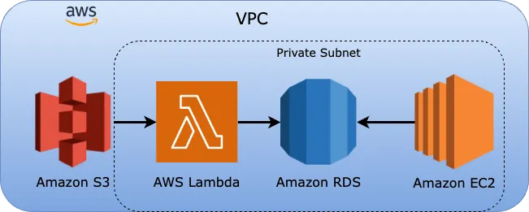
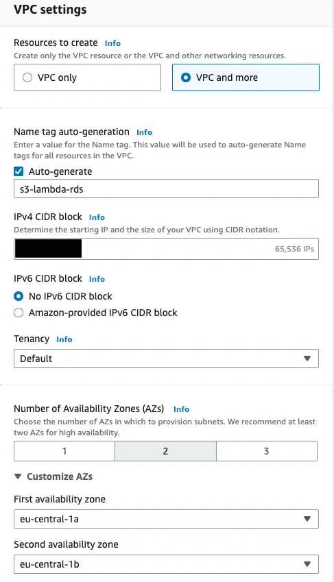
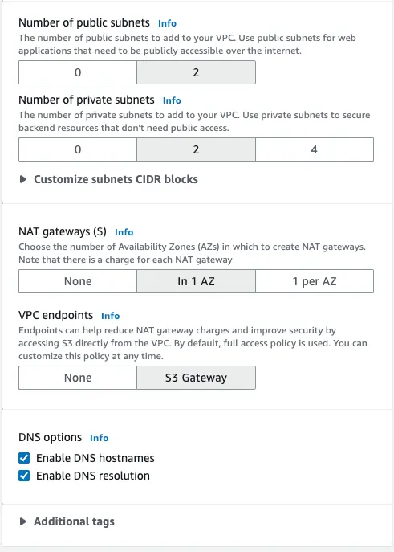
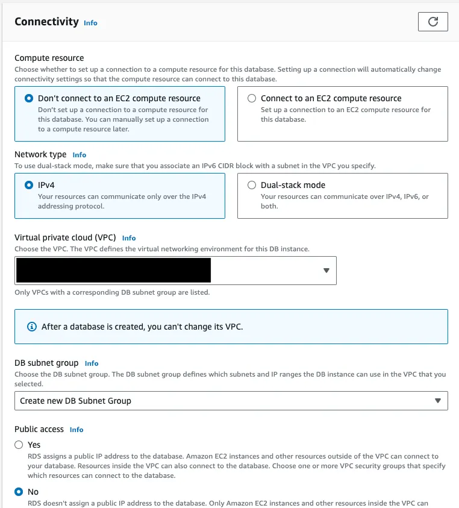
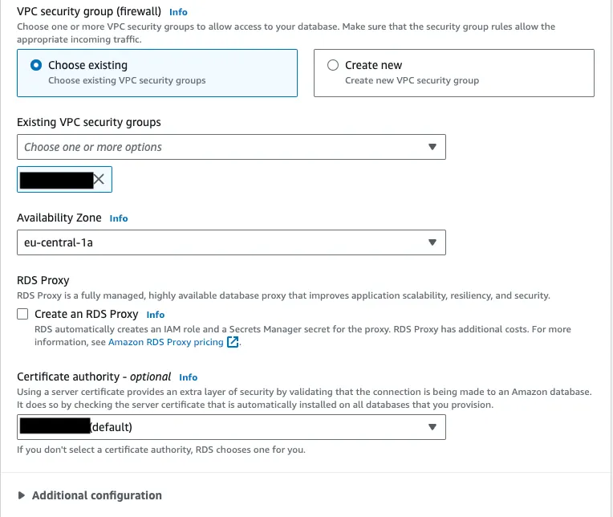
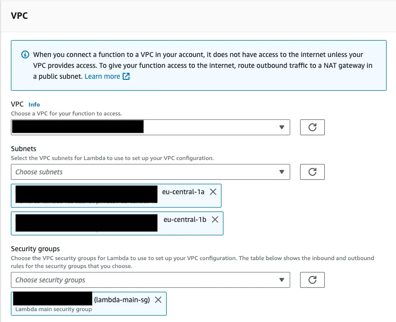
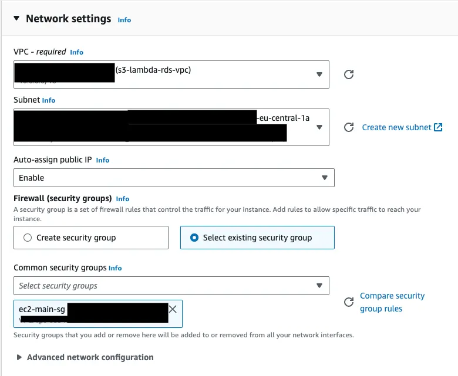

# Establishing a VPC for Amazon S3, Lambda, RDS and EC2

## Tech Stack

- Amazon VPC
- Amazon S3
- Amazon Lambda Function
- Amazon RDS
- Amazon EC2

## Overview

The connection between multiple services in AWS might sometimes get a bit complicated. When it comes to SSH connections or external connections, it gets even more complicated. In this article, we are going to establish a VPC for the above-mentioned services. 

Think of this as a project where we get the data from the S3 bucket using a Lambda function. After doing some modifications, data will be uploaded to Amazon RDS. In the end, we have to connect to the EC2 instance with SSH on our local machine (We may need to connect to the RDS database using DBeaver or we might need to do some other operations including other services in the VPC). 

Since this connection will be outside of AWS, we will need a public IP. We are going to establish security groups for the services RDS, Lambda, and EC2 and define inbound rules for each of them. In the end, we will be able to connect all services with each other inside a VPC (Virtual Private Cloud).

**Note:** Before we start, I will not mention the IAM roles or other details in this article. We will only be interested in VPC and the connections between services.

## Amazon VPC

The first thing we are going to do is create a new VPC. That's pretty much the heart of this article. Let's start with how to create and then explain why we did so.

**Navigation:** VPC → Your VPCs → Create VPC

### Configuration Steps

1. **VPC Type:** We should choose "VPC and more" to create the subnets and decide on availability zones as well.

2. **Name:** We can name the VPC however we want. But keep in mind that keeping it informative will be a wise choice.

3. **IPv4 Address:** We can define the IPv4 address. It should be a valid one. We can take the default one as well.

4. **Availability Zones:** Since we want to keep the high availability, we can choose the number of AZs as 2. We can customize them as `eu-central-1a` and `eu-central-1b`. The reason behind that is we are going to create our RDS database in `eu-central-1a`.

5. **Public Subnets:** We can also choose the number of public subnets as zero since we won't need public subnets. I created them in case they might be used for any other operation in the future.

6. **Private Subnets:** We can set the number of private subnets to 2. The reason is we need private subnets for RDS, Lambda, S3, and EC2 since these should definitely be in a secure environment and have high availability. 4 subnets might be a bit over-engineering, please keep that in mind. 2 private subnets will be enough for us.

7. **NAT Gateway:** In the end, we will need a public IP so that we can connect to our EC2 instance locally, that's why we have to create a NAT gateway. Using it in 1 AZ will be a better choice. We are going to select the AZ the same as RDS. Since it's a fully managed service, it might cause some amount of cost. That's why we better keep the number of NAT gateways low.

8. **VPC Endpoints:** We should choose VPC endpoints as the S3 gateway. This will allow us to access the S3 buckets directly from the VPC. While retrieving data from S3 using Lambda, this will be required. If this doesn't work correctly, we can create a separate endpoint with S3 Gateway (free choice) to be able to retrieve data from S3 from inside of VPC.

## Security Groups

We have to create 3 separate security groups for RDS, Lambda, and EC2. The most important part is choosing the VPC as the one we recently created. We want to locate all the services inside the same VPC. 

**Navigation:** EC2 → Security groups

### Lambda Security Group

- **Name:** `lambda-main-sg`
- **Inbound Rules:** None needed
- **Outbound Rules:** Leave as is

### EC2 Security Group

- **Name:** `ec2-main-sg`
- **Inbound Rules:** Add SSH
- **Outbound Rules:** Leave as is

### RDS Security Group

- **Name:** `rds-main-sg`
- **Inbound Rules:** 
  - Define SSH rule
  - Allow all traffic coming from the security group of Lambda (choose "All Traffic" as Type and paste the security group ID `sg-...`)
  - Alternative: Add the subnet IPs that will be used by RDS and Lambda as the inbound rule
- **Outbound Rules:** Leave as is

This configuration will allow Lambda to access RDS.

## Amazon RDS

In this part, I am going to explain how to create an RDS database with the newly created VPC configuration. I will leave all other options up to your use case since they are not this article's topics. The related section while creating the RDS will be **Connectivity**.

### Connectivity Configuration

1. **EC2 Compute Resource:** We are not going to connect our RDS database directly to EC2 compute resource since we will connect it via SSH already.

2. **VPC:** Choose the VPC we created.

3. **Public Access:** Should definitely be **No** since one of the main purposes of creating this VPC is to keep the services private.

4. **Security Group:** Choose the one we just created: `rds-main-sg`. This is one of the most crucial parts while creating the RDS database.

5. **Other Options:** We can leave other options as is at least from the VPC perspective.

We can create the RDS MySQL database as described above inside our VPC and with the security group we created.

## Amazon Lambda Function

After creating the Lambda function with a desired method (Docker image is suggested), we can now assign the VPC and security group to our function.

**Navigation:** Lambda Function → Configuration → VPC

### VPC Configuration

1. **VPC:** Choose the VPC we created.

2. **Subnets:** We have to choose the same subnets as the RDS. We can check RDS's subnets from its dashboard.

3. **Security Group:** Choose the one we created (`lambda-main-sg`). This will allow us to access RDS.

I will leave other parts to you since those are not in this article's scope.

## Amazon EC2

We will go through how we can include the EC2 instance in the VPC and still connect it from the local machine via SSH tunnel. The related section is **Network settings**.

**Navigation:** EC2 → Create instance → Network settings

### Network Configuration

1. **VPC:** Choose our VPC

2. **Subnet:** Choose the subnet located in `eu-central-1a`. We should choose it in the same AZ since subnets cannot extend to other AZs.

3. **Auto-assign public IP:** **Enable**. This part is really important since we will definitely need a public IP to be able to connect to EC2 remotely.

4. **Security Group:** Choose the one we created (`ec2-main-sg`). This will allow us to access the RDS and read the data in DBeaver.

## Completion

After creating the EC2 instance, we completed the whole VPC. There's nothing to do for S3 since we created a VPC endpoint for the S3 gateway. Lambda will automatically be able to retrieve data from S3. We created the EC2 instance with a private subnet and a public IP since we will connect it from our local machine. S3 is going to access VPC via endpoint and RDS, Lambda is already located in a private subnet of our VPC.

## Important Cost Warning

⚠️ **Don't forget to delete VPC and especially the NAT gateway since it will cost:**
- $0.052 per hour
- $0.005 per Elastic IP address not attached to a running instance per hour (prorated)

Please be careful about the deletion of the NAT gateway and VPC.
